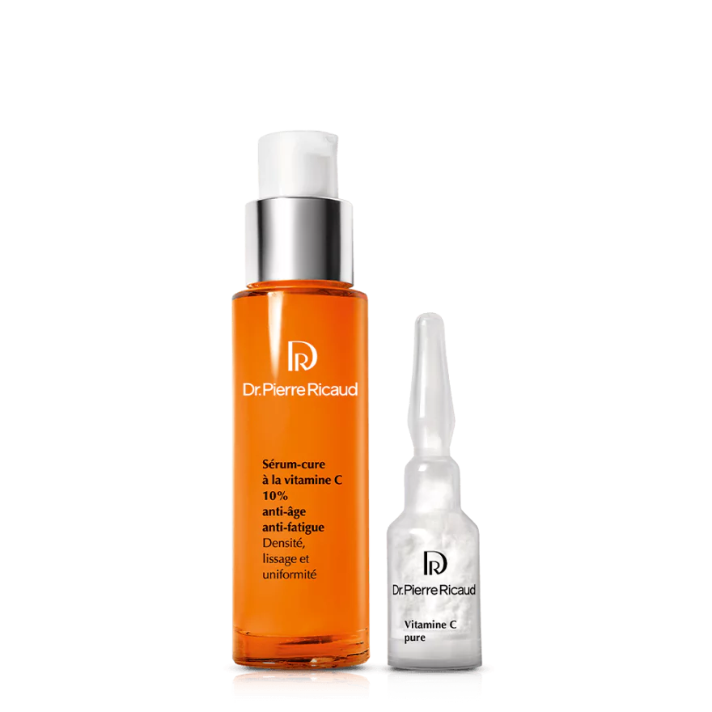

# S03 – Concentration d'un actif : que signifie "à 5%" ? 📝

**Concentration massique – Quantité de matière – Masse molaire**

> En BTS MECP, on attend des réponses **rédigées**, **justifiées** et utilisant un **vocabulaire scientifique précis**.
> Un calcul sans interprétation est considéré comme **incomplet**.

---

## 🎯 Objectifs de la séance

À l'issue de cette séance, vous serez capables de :

- **définir** la concentration massique et son unité
- **calculer** une concentration à partir de données expérimentales
- **convertir** entre pourcentage et g/L
- **interpréter** une concentration dans un contexte professionnel
- **vérifier** la conformité d'un produit à un cahier des charges

---

## 🧴 Pourquoi c'est important pour votre métier ?

En institut ou en laboratoire cosmétique, vous serez confronté(e) à ces situations :

- **L'étiquette indique "Vitamine C 10%"** → Que signifie réellement ce chiffre ? Est-ce beaucoup ?
- **Le cahier des charges impose 5 à 8 g/L d'actif** → Comment vérifier que le produit est conforme ?
- **Vous devez préparer 250 mL de solution à 20 g/L** → Quelle masse d'actif peser ?
- **Un client demande un produit "plus concentré"** → Comment comparer deux produits ?

> 💡 *Sur une étiquette, "5%" et "50 g/L" désignent (presque) la même chose. Mais savez-vous pourquoi ? Et comment passer de l'un à l'autre ? C'est ce que nous allons découvrir !*

👉 **Cette séance vous permettra** de comprendre, calculer et interpréter les concentrations indiquées sur les produits cosmétiques.

---

## 🧴 Situation professionnelle

Vous travaillez au **service contrôle qualité** d'un laboratoire cosmétique.

Un nouveau lot de **sérum à la vitamine C** vient d'être produit. Avant sa commercialisation, vous devez vérifier que la **concentration en actif** est conforme au cahier des charges.

> *« Le sérum doit contenir entre 10% et 15% de vitamine C. Le lot analysé est-il conforme ? »*

{.img-center width="50%"}

---

## 📄 Documents fournis

### Document 1 – Fiche technique du sérum

| Information | Valeur |
|-------------|--------|
| **Nom commercial** | Sérum Éclat Vitamine C |
| **Actif principal** | Acide ascorbique (Vitamine C) |
| **Concentration annoncée** | 12% |
| **Volume du flacon** | 30 mL |
| **pH** | 3,5 ± 0,5 |

---

### Document 2 – Analyse du lot n°2024-156

Le laboratoire a analysé le lot et obtenu les résultats suivants :

| Paramètre | Résultat |
|-----------|----------|
| Volume de sérum analysé | 50,0 mL |
| Masse de vitamine C dosée | 5,8 g |
| pH mesuré | 3,4 |

---

### Document 3 – Cahier des charges

| Paramètre | Spécification |
|-----------|---------------|
| Concentration en vitamine C | 10% à 15% (soit 100 à 150 g/L) |
| pH | 3,0 à 4,0 |
| Aspect | Limpide, incolore à jaune pâle |

---

### Document 4 – Rappel : la concentration massique

La **concentration massique** (notée **Cm**) exprime la **masse de soluté** dissoute dans un **volume de solution**.

$$C_m = \frac{m}{V}$$

| Grandeur | Symbole | Unité |
|----------|:-------:|:-----:|
| Concentration massique | Cm | g·L⁻¹ (ou g/L) |
| Masse de soluté | m | g |
| Volume de solution | V | L |

**Formules dérivées :**

$$m = C_m \times V \qquad \text{et} \qquad V = \frac{m}{C_m}$$

---

### Document 5 – Relation pourcentage / concentration massique

Pour les **solutions aqueuses diluées** (densité ≈ 1 g/mL), on peut utiliser l'approximation :

$$\text{Concentration en g/L} \approx \text{Pourcentage} \times 10$$

| Pourcentage | Concentration massique |
|:-----------:|:----------------------:|
| 1% | ≈ 10 g/L |
| 5% | ≈ 50 g/L |
| 10% | ≈ 100 g/L |
| 12% | ≈ 120 g/L |
| 15% | ≈ 150 g/L |

---

## 🔬 Travail 1 – Comprendre la concentration massique

### 1.1 – Sens physique

1\. La concentration massique Cm = 20 g/L signifie que :

☐ 20 g de solution contiennent 1 L de soluté

☐ 1 L de solution contient 20 g de soluté

☐ 20 L de solution contiennent 1 g de soluté

2\. Reformulez avec vos mots : *"Un sérum à 50 g/L de vitamine C, cela signifie que..."*

   

---

### 1.2 – Identifier les grandeurs

Dans la formule Cm = m/V, reliez chaque grandeur à sa signification :

| Grandeur | | Signification |
|----------|---|---------------|
| Cm | | Masse de l'actif dissous |
| m | | Volume total du produit |
| V | | Quantité d'actif par litre de produit |

---

## 🧮 Travail 2 – Calculer une concentration (méthode D.U.C.I.)

> 🎯 **Compétence E2 : Mobiliser** – Utiliser la méthode de calcul appropriée.

### Application au lot n°2024-156

À partir du **Document 2**, calculez la concentration massique en vitamine C du lot analysé.

**Suivez la méthode D.U.C.I. :**

#### D – Données

Identifiez et notez les données utiles :

- Soluté : _______________________
- Masse de soluté : m = _______ g
- Volume de solution : V = _______ mL = _______ L

#### U – Unités

Vérifiez que vos unités sont correctes :
- Masse en **grammes** (g) : ☐ OK
- Volume en **litres** (L) : ☐ OK

#### C – Calcul

Écrivez la formule, remplacez par les valeurs, calculez :

$$C_m = \frac{m}{V} = \frac{.........}{.........} = ......... \ \ g·L^{-1}$$

#### I – Interprétation

Complétez la phrase d'interprétation :

> *La concentration massique en vitamine C du lot n°2024-156 est de _______ g·L⁻¹. Cela signifie que chaque litre de sérum contient _______ g de vitamine C.*

---

## 📊 Travail 3 – Convertir et comparer

### 3.1 – Conversion g/L ↔ pourcentage

À partir du **Document 5**, convertissez la concentration calculée en pourcentage :

1\. Concentration calculée : Cm = _______ g/L

2\. Conversion en pourcentage : _______ g/L ÷ 10 ≈ _______ %

---

### 3.2 – Vérification de conformité

À partir du **Document 3** (cahier des charges) :

1\. L'intervalle de conformité est : _______ % à _______ % (soit _______ à _______ g/L)

2\. La concentration du lot (_______ g/L soit _______ %) est-elle dans cet intervalle ?

☐ Oui, le lot est **conforme**
☐ Non, le lot est **non conforme**

3\. **Rédigez une conclusion professionnelle** (2-3 lignes) :

    

---

## 🔄 Travail 4 – Calculs inverses

> 🎯 **Compétence E2 : Mobiliser** – Manipuler les formules.

### 4.1 – Calculer une masse à peser

On souhaite préparer **500 mL** d'une solution de glycérine à **30 g/L**.

**Quelle masse de glycérine faut-il peser ?**

#### D – Données

- Concentration souhaitée : Cm = _______ g/L
- Volume à préparer : V = _______ mL = _______ L
- Masse à calculer : m = ?

#### C – Calcul

On cherche m. D'après Cm = m/V, on a : **m = Cm × V**

$$m = ......... \times ......... = ......... \text{ g}$$

#### I – Interprétation

> *Pour préparer 500 mL de solution à 30 g/L, il faut peser _______ g de glycérine et compléter avec de l'eau jusqu'à 500 mL.*

---

### 4.2 – Calculer un volume

On dispose de **12 g** d'acide hyaluronique. On veut préparer une solution à **20 g/L**.

**Quel volume de solution peut-on préparer ?**

#### D – Données

- Masse disponible : m = _______ g
- Concentration souhaitée : Cm = _______ g/L
- Volume à calculer : V = ?

#### C – Calcul

On cherche V. D'après Cm = m/V, on a : **V = m / Cm**

$$V = \frac{.........}{.........} = ......... \text{ L} = ......... \text{ mL}$$

#### I – Interprétation

   

---

## 📈 Travail 5 – Interpréter des données (niveau E2)

> 🎯 **Compétence E2 : Interpréter** – Donner du sens aux résultats.

### Situation : Comparaison de trois sérums

Un laboratoire analyse trois sérums à la vitamine C de marques différentes :

| Sérum | Masse de vitamine C dosée | Volume analysé | Concentration (à calculer) |
|:-----:|:-------------------------:|:--------------:|:--------------------------:|
| A | 6,0 g | 50 mL | |
| B | 4,5 g | 30 mL | |
| C | 10,0 g | 100 mL | |

### Questions :

1\. Calculez la concentration massique de chaque sérum (montrez vos calculs) :

**Sérum A :**
  

**Sérum B :**
  

**Sérum C :**
  

2\. Classez les trois sérums du **moins concentré au plus concentré** :

_______ < _______ < _______

3\. Le cahier des charges impose une concentration entre **100 et 150 g/L**. Quels sérums sont conformes ?

  

4\. Un client demande "le sérum le plus efficace". Pouvez-vous lui recommander le plus concentré ? Justifiez en 2-3 lignes (pensez aux limites de ce raisonnement).

    

---

## 🚀 Travail 6 – Approfondissement (pour aller plus loin)

> ⚡ Ce travail est **facultatif**. Il introduit la notion de quantité de matière.

### La quantité de matière (n) et la masse molaire (M)

En chimie, on utilise parfois la **quantité de matière** (n, en moles) plutôt que la masse.

$$n = \frac{m}{M}$$

| Grandeur | Symbole | Unité |
|----------|:-------:|:-----:|
| Quantité de matière | n | mol |
| Masse | m | g |
| Masse molaire | M | g·mol⁻¹ |

**Données :** La masse molaire de la vitamine C (C₆H₈O₆) est M = 176 g/mol.

### Questions :

1\. Le sérum B contient 4,5 g de vitamine C. Calculez la quantité de matière correspondante :

$$n = \frac{m}{M} = \frac{.........}{.........} = ......... \text{ mol}$$

2\. Convertissez en millimoles (1 mol = 1000 mmol) : n = _______ mmol

3\. Pourquoi utilise-t-on parfois les moles plutôt que les grammes en chimie ?

   

---

## ✍️ Synthèse personnelle (entraînement E2 – 5 à 7 lignes)

> 🎯 **Compétence E2 : Communiquer**

Rédigez un **court paragraphe** expliquant comment vérifier qu'un produit cosmétique respecte le cahier des charges en termes de concentration.

**Votre synthèse doit contenir :**
- La définition de la concentration massique
- La méthode de calcul
- L'importance de l'interprétation du résultat

**Mots obligatoires à placer :**
*concentration massique – g/L – masse – volume – cahier des charges – conforme*

       

---

## 🏆 Mes réussites aujourd'hui

Avant de passer à l'auto-évaluation, prenez un moment pour reconnaître vos progrès !

**Cochez ce que vous avez réussi à faire :**

| Réussite | ✓ |
|----------|---|
| J'ai compris ce que signifie "concentration massique" | ☐ |
| J'ai réussi à calculer une concentration avec Cm = m/V | ☐ |
| J'ai su convertir les unités (mL → L) avant de calculer | ☐ |
| J'ai su utiliser les formules inverses (m = Cm × V ou V = m/Cm) | ☐ |
| J'ai rédigé une interprétation de mon résultat | ☐ |
| J'ai vérifié une conformité par rapport à un cahier des charges | ☐ |

💡 **Chaque case cochée est une victoire !** La concentration est une notion fondamentale que vous utiliserez toute l'année (dilutions, dosages, TP...).

---

## ✅ Auto-évaluation

Avant de rendre votre travail, vérifiez :

| Critère | ✓ |
|---------|---|
| J'ai identifié les données (m, V) avant de calculer | ☐ |
| J'ai converti les volumes en litres | ☐ |
| J'ai écrit la formule avant de remplacer par les valeurs | ☐ |
| Mes résultats ont une unité (g/L ou g·L⁻¹) | ☐ |
| J'ai interprété mes résultats (phrase explicative) | ☐ |
| J'ai rédigé ma synthèse avec les mots obligatoires | ☐ |

---

## 🔗 Pour la suite de la progression

Dans la **séance suivante (S04)**, nous apprendrons à **modifier** une concentration :

- Qu'est-ce qu'une **dilution** ?
- Comment calculer un **facteur de dilution** ?
- Comment préparer une solution diluée à partir d'une solution concentrée ?

---

## 🔧 Outil méthodologique associé

➡️ [**Fiche méthode 02 – Calculer et interpréter une concentration**](../Methodologie/02_fiche_methode/)

---

## 📺 Pour réviser en vidéo

🎬 **[La concentration massique – Unisciel](https://www.youtube.com/watch?v=2BHlq_bWF8Q)** – 4 min
*Définition, formule et exemples de calculs.*

🎬 **[Convertir des unités (mL, L, g)](https://www.youtube.com/watch?v=K7_q4cLG4yM)** – 3 min
*Maîtriser les conversions indispensables pour les calculs.*

🎬 **[Calculer une concentration pas à pas](https://www.youtube.com/watch?v=QhXm6HfxMlA)** – 6 min
*Méthode complète avec exemples variés.*

💡 **Conseil** : Si vous avez des difficultés avec les conversions mL → L, regardez d'abord la vidéo sur les unités !
